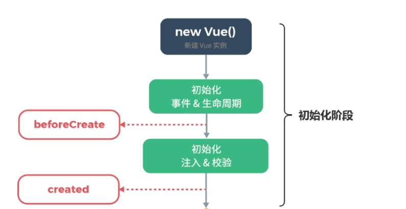
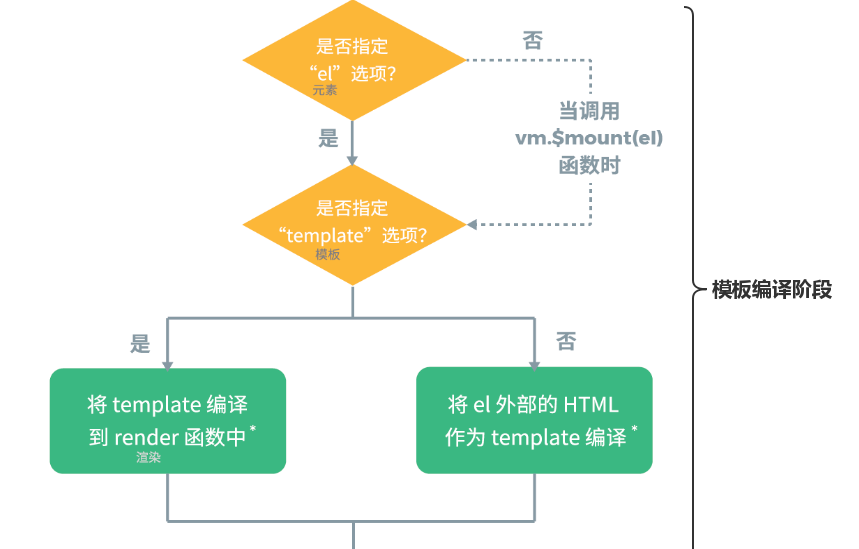
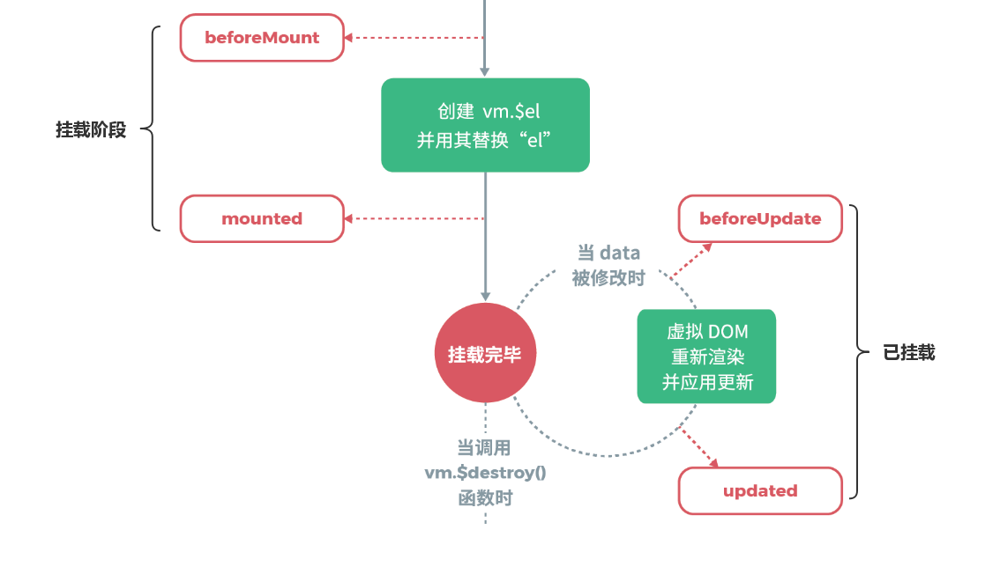
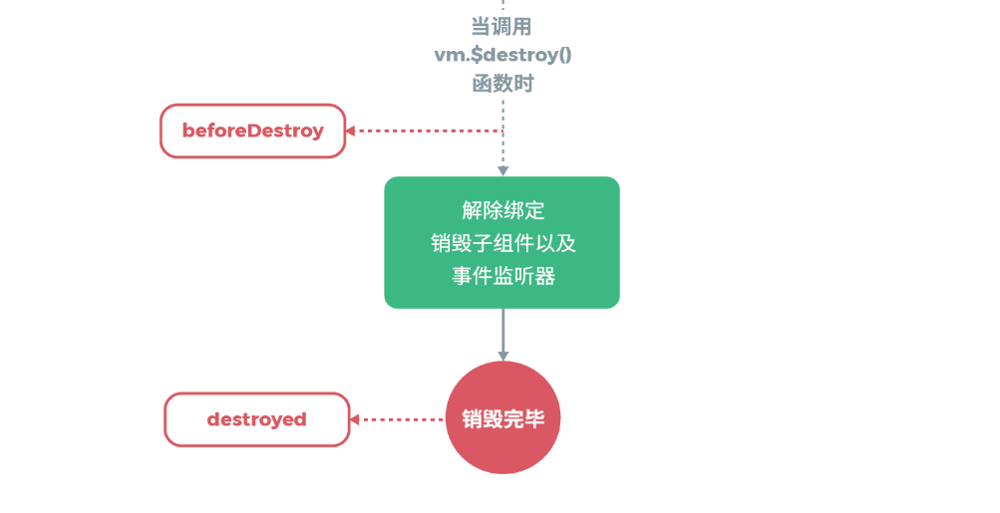

#### 生命周期 [参考](https://nlrx-wjc.github.io/Learn-Vue-Source-Code/lifecycle/#_1-%E5%89%8D%E8%A8%80)

#### 初始化阶段


##### new Vue（src/core/instance/index.js）
```
function Vue (options) {
  if (process.env.NODE_ENV !== 'production' &&
    !(this instanceof Vue)
  ) {
    warn('Vue is a constructor and should be called with the `new` keyword')
  }
  /*初始化*/
  this._init(options)
}
```

###### initMixin（src/core/instance/init.js）
就做了一件事情，在Vue的原型上增加_init方法，构造Vue实例的时候会调用这个_init方法来初始化Vue实例，mergeOptions 选项合并 data,create,methods... （比如mixins中写的和当前组件合并）
```
export function initMixin (Vue: Class<Component>) {
  Vue.prototype._init = function (options?: Object) {
    ...

    // merge options
    if (options && options._isComponent) {
      //优化内部组件实例化，由于动态选项合并非常缓慢，内部组件选项需要特殊处理。
      initInternalComponent(vm, options)
    } else {
      // mergeOptions 选项合并 data,create,methods... （比如mixins中写的和当前组件合并）
      vm.$options = mergeOptions(
        resolveConstructorOptions(vm.constructor),
        options || {},
        vm
      )
    }

    /*初始化生命周期*/
    initLifecycle(vm)
    /*初始化事件*/
    initEvents(vm)
    /*初始化render*/
    initRender(vm)
    /*调用callHook函数并且触发 beforeCreate 钩子事件*/
    callHook(vm, 'beforeCreate')
    // 初始化 inject 必须在 data/props 初始化之前
    initInjections(vm) // resolve injections before data/props
    /*初始化props、methods、data、computed与watch*/
    initState(vm)
    // 初始化 provide 必须在 data/props 之后
    initProvide(vm) // resolve provide after data/props
    /*调用callHook函数并且触发 created 钩子事件*/
    callHook(vm, 'created')

    ...
  }
}
```

###### initLifecycle（src/core/instance/lifecycle.js）
```
/*初始化生命周期*/
export function initLifecycle (vm: Component) {
  const options = vm.$options

  // locate first non-abstract parent
  /* 将vm对象存储到parent组件中（保证parent组件是非抽象组件，比如keep-alive） */
  let parent = options.parent
  if (parent && !options.abstract) {
    while (parent.$options.abstract && parent.$parent) {
      parent = parent.$parent
    }
    parent.$children.push(vm)
  }

  vm.$parent = parent
  vm.$root = parent ? parent.$root : vm

  vm.$children = []
  vm.$refs = {}

  vm._watcher = null
  vm._inactive = null
  vm._directInactive = false
  vm._isMounted = false
  vm._isDestroyed = false
  vm._isBeingDestroyed = false
}
```

>从代码中可以看到，逻辑是这样子的：如果当前组件不是抽象组件并且存在父级，那么就通过while循环来向上循环，如果当前组件的父级是抽象组件并且也存在父级，那就继续向上查找当前组件父级的父级，直到找到第一个不是抽象类型的父级时，将其赋值vm.$parent，同时把该实例自身添加进找到的父级的$children属性中。这样就确保了在子组件的$parent属性上能访问到父组件实例，在父组件的$children属性上也能访问子组件的实例。
```
let parent = options.parent
if (parent && !options.abstract) {
  while (parent.$options.abstract && parent.$parent) {
    parent = parent.$parent
  }
  parent.$children.push(vm)
}
```
>实例的$root属性表示当前实例的根实例，挂载该属性时，首先会判断如果当前实例存在父级，那么当前实例的根实例$root属性就是其父级的根实例$root属性，如果不存在，那么根实例$root属性就是它自己。举个例子：假如有一个人，他如果有父亲，那么他父亲的祖先肯定也是他的祖先，同理，他的儿子的祖先也肯定是他的祖先，我们不需要真正的一层一层的向上递归查找到他祖先本人，只需要知道他父亲的祖先是谁然后告诉他即可。如果他没有父亲，那说明他自己就是祖先，那么他后面的儿子、孙子的$root属性就是他自己了。
```
vm.$root = parent ? parent.$root : vm
```

###### initEvents 初始化事件（src/core/instance/events.js） - processAttrs 解析事件（src/compiler/parser/index.js）
```
/*初始化事件*/
export function initEvents (vm: Component) {
  /*在vm上创建一个_events对象，用来存放事件。*/
  vm._events = Object.create(null)
  /*这个bool标志位来表明是否存在钩子，而不需要通过哈希表的方法来查找是否有钩子，这样做可以减少不必要的开销，优化性能。*/
  vm._hasHookEvent = false

  // init parent attached events 初始化父组件attach的事件
  const listeners = vm.$options._parentListeners
  if (listeners) {
    updateComponentListeners(vm, listeners)
  }
}
```

###### initInjections 和 initProvide （src/core/instance/inject.js）
```
// 遍历inject的key从父/祖父组件中把provide的值捕捉下来
export function initInjections (vm: Component) {}
```
```
// 初始化 inject 必须在 data/props 初始化之前
initInjections(vm) // resolve injections before data/props
/*初始化props、methods、data、computed与watch*/
initState(vm)
// 初始化 provide 必须在 data/props 之后
initProvide(vm) // resolve provide after data/props
```
为什么 inject 必须在 data/props 初始化之前，而provide 必须在 data/props 之后
>root → parent → child

>root不需要provide，child不需要inject，inject之所以在initState前面是因为，可以在data/props中获取，而provide则是因为可能需要访问data/props中的属性，所以得在initState初始化后

###### initState （src/core/instance/state.js）
初始化props、methods、data、computed与watch
```
export function initState (vm: Component) {
  vm._watchers = []
  const opts = vm.$options
  if (opts.props) initProps(vm, opts.props) /*初始化props*/
  if (opts.methods) initMethods(vm, opts.methods) /*初始化方法*/
  if (opts.data) { /*初始化data*/
    initData(vm)
  } else { /*该组件没有data的时候绑定一个空对象*/
    observe(vm._data = {}, true /* asRootData */)
  }
  if (opts.computed) initComputed(vm, opts.computed) /*初始化computed*/
  if (opts.watch && opts.watch !== nativeWatch) { /*初始化watch*/
    initWatch(vm, opts.watch)
  }
}

```

#### 模板编译阶段


模板编译阶段并不是存在于Vue的所有构建版本中，它只存在于完整版（即vue.js）中。在只包含运行时版本（即vue.runtime.js）中并不存在该阶段，这是因为当使用vue-loader或vueify时，*.vue文件内部的模板会在构建时预编译成渲染函数，所以是不需要编译的，从而不存在模板编译阶段，由上一步的初始化阶段直接进入下一阶段的挂载阶段。

在这里，我们有必要介绍一下什么是完整版和只包含运行时版。

vue基于源码构建的有两个版本，一个是runtime only(一个只包含运行时的版本)，另一个是runtime + compiler(一个同时包含编译器和运行时的完整版本)。而两个版本的区别仅在于后者包含了一个编译器。

- entry-compiler.js
- entry-runtime-with-compiler.js

###### 完整版的vm.$mount方法分析（src/platforms/web/entry-runtime-with-compiler.js）
```
// 函数劫持 将原来的mount函数获取到之后重写mount函数
const mount = Vue.prototype.$mount
Vue.prototype.$mount = function (
  el?: string | Element,
  hydrating?: boolean
): Component {
  el = el && query(el)

  /* istanbul ignore if */
  if (el === document.body || el === document.documentElement) {
    process.env.NODE_ENV !== 'production' && warn(
      `Do not mount Vue to <html> or <body> - mount to normal elements instead.`
    )
    return this
  }

  const options = this.$options
  // resolve template/el and convert to render function
  if (!options.render) {
    let template = options.template
    if (template) {
      if (typeof template === 'string') {
        if (template.charAt(0) === '#') {
          template = idToTemplate(template)
          /* istanbul ignore if */
          if (process.env.NODE_ENV !== 'production' && !template) {
            warn(
              `Template element not found or is empty: ${options.template}`,
              this
            )
          }
        }
      } else if (template.nodeType) {  //如果给的模板是一个dom元素  则拿模板中的内容
        template = template.innerHTML
      } else {
        if (process.env.NODE_ENV !== 'production') {
          warn('invalid template option:' + template, this)
        }
        return this
      }
    } else if (el) { //如果没有模板则使用el对应的template
      template = getOuterHTML(el)
    }
    if (template) {
      /* istanbul ignore if */
      if (process.env.NODE_ENV !== 'production' && config.performance && mark) {
        mark('compile')
      }
      
      // 直接将模板变成render函数
      const { render, staticRenderFns } = compileToFunctions(template, {
        outputSourceRange: process.env.NODE_ENV !== 'production',
        shouldDecodeNewlines,
        shouldDecodeNewlinesForHref,
        delimiters: options.delimiters,
        comments: options.comments
      }, this)
      options.render = render
      options.staticRenderFns = staticRenderFns

      /* istanbul ignore if */
      if (process.env.NODE_ENV !== 'production' && config.performance && mark) {
        mark('compile end')
        measure(`vue ${this._name} compile`, 'compile', 'compile end')
      }
    }
  }
  return mount.call(this, el, hydrating)
}
```

#### 挂载阶段（src/core/instance/lifecycle.js）


```
/*挂载组件*/
export function mountComponent (
  vm: Component,
  el: ?Element,
  hydrating?: boolean
): Component {
  vm.$el = el
  if (!vm.$options.render) {
    vm.$options.render = createEmptyVNode
  }

  /*触发beforeMount钩子*/
  callHook(vm, 'beforeMount')

  /*updateComponent作为Watcher对象的getter函数，用来依赖收集*/
  let updateComponent

  // we set this to vm._watcher inside the watcher's constructor
  // since the watcher's initial patch may call $forceUpdate (e.g. inside child
  // component's mounted hook), which relies on vm._watcher being already defined
  /*这里对该vm注册一个Watcher实例，Watcher的getter为updateComponent函数，用于触发所有渲染所需要用到的数据的getter，进行依赖收集，该Watcher实例会存在所有渲染所需数据的闭包Dep中*/
  new Watcher(vm, updateComponent, noop, {
    before () {
      if (vm._isMounted && !vm._isDestroyed) {
        callHook(vm, 'beforeUpdate')
      }
    }
    //true 用于标识 是一个渲染watcher
  }, true /* isRenderWatcher */)
  hydrating = false

  // manually mounted instance, call mounted on self
  // mounted is called for render-created child components in its inserted hook
  if (vm.$vnode == null) { /*标志位，代表该组件已经挂载 调用mounted钩子*/
    vm._isMounted = true
    callHook(vm, 'mounted')
  }
  return vm
}

```

#### 销毁阶段（src/core/instance/lifecycle.js）


```
Vue.prototype.$destroy = function () {
  const vm: Component = this
  if (vm._isBeingDestroyed) {
    return
  }
  /* 调用beforeDestroy钩子 */
  callHook(vm, 'beforeDestroy')
  vm._isBeingDestroyed = true
  // remove self from parent
  const parent = vm.$parent

  if (parent && !parent._isBeingDestroyed && !vm.$options.abstract) {
    remove(parent.$children, vm)
  }

  // teardown watchers
    /* 该组件下的所有Watcher从其所在的Dep中释放 */
  if (vm._watcher) {
    vm._watcher.teardown()
  }
  let i = vm._watchers.length

  while (i--) {
    vm._watchers[i].teardown()
  }

  // remove reference from data ob
  // frozen object may not have observer.
  if (vm._data.__ob__) {
    vm._data.__ob__.vmCount--
  }
  // call the last hook...
  vm._isDestroyed = true
  // invoke destroy hooks on current rendered tree
  vm.__patch__(vm._vnode, null)
  // fire destroyed hook
  callHook(vm, 'destroyed')

  // turn off all instance listeners. /* 移除所有事件监听 */
  vm.$off()
  // remove __vue__ reference
  if (vm.$el) {
    vm.$el.__vue__ = null
  }
  // release circular reference (#6759)
  if (vm.$vnode) {
    vm.$vnode.parent = null
  }
}
```
