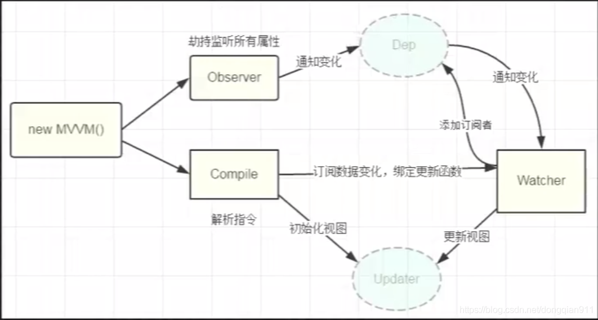

#### 深入响应式 [参考](https://blog.csdn.net/zimeng303/article/details/111087848)

Vue 的双向绑定既不是发布订阅模式，也不是观察者模式，而是结合了这两种模式的一种自定义的实现方式。这种方式被称为“响应式系统”。

在 Vue 中，数据双向绑定的实现是通过使用 `defineProperty` 方法来劫持 Vue 实例中的数据，为每个被劫持的属性对象添加一个 `Dep` 对象。`Dep` 对象是一个可观察对象，其中包含了一组 `Watcher` 对象，用于监听该属性的改变。

当 Vue 实例中被劫持的属性发生变化时，会通知相关的 `Dep` 对象，进而调用所有与该属性相关的 `Watcher` 对象的更新方法，从而触发相应视图的更新。

因此，Vue 的双向绑定机制可以看作是响应式系统的一种实现方式，它既包含了观察者模式中的观察目标和观察者的概念，又充分利用了发布-订阅模式中的调度中心和事件通知的机制。

需要特别注意的是，Vue 2.x 中的响应式系统采用的是 `Object.defineProperty` 实现的，而 Vue 3.x 则采用了更高效的 Proxy 实现方式，但两个版本的实现都是基于响应式系统的思想来设计的。


这张图比较清晰地展示了整个流程，首先通过一次渲染操作触发Data的getter（这里保证只有视图中需要被用到的data才会触发getter）进行依赖收

集，这时候其实Watcher与data可以看成一种被绑定的状态（实际上是data的闭包中有一个Deps订阅者，在修改的时候会通知所有的Watcher观察者），

在data发生变化的时候会触发它的setter，setter通知Watcher，Watcher进行回调通知组件重新渲染的函数，之后根据diff算法来决定是否发生视图

的更新。



- 双向绑定由三个重要部分构成：
    - 数据层（Model）：应用数据及业务逻辑
    - 视图层（View）：应用的展示效果，各类UI组件
    - 业务逻辑层（ViewModel）：框架封装的核心，负责将数据与视图关联起来（数据变化更新视图，视图变化更新数据）
      - ViewModel两个主要部分组成：
        - 监听器（Observer）：对所有数据的属性进行监听
        - 解析器（Compiler）：对每个节点的指令进行扫描跟解析，根据指令模板替换数据，以及绑定相应的更新函数


##### dep + watcher关系
```
  - 首先得清楚dep与watcher是什么？dep 与 watcher 之间的关系

    - dep观察目标（每个属性都有一个dep） 与 watcher观察者（每一个组件都有一个watcher实例） 的关系

    - 一个组件中 有多个属性（n个属性形成一个视图） 一个watcher对应着n个dep

    - 一个属性对应着多个组件 1个dep对应着多个watcher 

    - dep 和 watcher 多对多的关系
```

​          
###### 实现：new Vue() → initState() → initData() → observe数据劫持（ getter:dep依赖收集 + setter:dep.notify通知更新）+ dep + watcher
  - new Vue *实例化Vue*
  - initState *初始化 props、methods、data、computed与watch*
  - initData *数据初始化函数*
  - observe *数据劫持* + dep *依赖收集* + watcher *视图更新*
                 

##### new Vue（src/core/instance/index.js）
```
function Vue (options) {
  if (process.env.NODE_ENV !== 'production' &&
    !(this instanceof Vue)
  ) {
    warn('Vue is a constructor and should be called with the `new` keyword')
  }
  /*初始化*/
  this._init(options)
}
```

##### initState（src/core/instance/state.js）
```
/*初始化 props、methods、data、computed与watch*/
export function initState (vm: Component) {
  vm._watchers = []
  const opts = vm.$options
  if (opts.props) initProps(vm, opts.props) /*初始化props*/
  if (opts.methods) initMethods(vm, opts.methods) /*初始化方法*/
  if (opts.data) { /*初始化data*/
    initData(vm)
  } else { /*该组件没有data的时候绑定一个空对象*/
    observe(vm._data = {}, true /* asRootData */)
  }
  if (opts.computed) initComputed(vm, opts.computed) /*初始化computed*/
  if (opts.watch && opts.watch !== nativeWatch) { /*初始化watch*/
    initWatch(vm, opts.watch)
  }
}
```

##### initData（src/core/instance/state.js）
```
// 初始化data
function initData (vm: Component) {
  let data = vm.$options.data

  //data可能是函数和对象 vue3认定是函数
  data = vm._data = typeof data === 'function'
    ? getData(data, vm)
    : data || {}
  
  // 类型检查 如果不是对象返回警告
  if (!isPlainObject(data)) {
    data = {}
    process.env.NODE_ENV !== 'production' && warn(
      'data functions should return an object:\n' +
      'https://vuejs.org/v2/guide/components.html#data-Must-Be-a-Function',
      vm
    )
  }
  // proxy data on instance
  const keys = Object.keys(data)
  const props = vm.$options.props
  const methods = vm.$options.methods
  let i = keys.length

  // 遍历data数据 保证data中的数据 与 props 和 methods 不重复
  while (i--) {
    const key = keys[i]
    if (process.env.NODE_ENV !== 'production') {
      if (methods && hasOwn(methods, key)) {
        warn(
          `Method "${key}" has already been defined as a data property.`,
          vm
        )
      }
    }
    if (props && hasOwn(props, key)) {
      process.env.NODE_ENV !== 'production' && warn(
        `The data property "${key}" is already declared as a prop. ` +
        `Use prop default value instead.`,
        vm
      )
    } else if (!isReserved(key)) { //检查字符串是否以 $ 或 _ 开头

      // vm.xxx  代理到 vm._data.xxx 方便用户使用
      proxy(vm, `_data`, key)
    }
  }
  // 数据观测
  observe(data, true /* asRootData */)
}
```
##### observe（数据劫持 getter:dep依赖收集 + setter:dep.notify通知更新）（src/core/observer/index.js）
```
  - 核心：data数据的劫持 + 属性getter依赖收集 + 属性setter变化通知更新

    - 数据初始化时，使用Object.defineProperty对数据进行“重写”，在getter中进行依赖收集（dep收集器），dep同时也记录了当前的视图watcher（观察者模式）

    - 当data数据改变后，setter中通过dep.notify()通知对应的watcher，去更新视图
```
```
/** 数据劫持 核心*/
export function defineReactive (
  obj: Object,
  key: string,
  val: any,
  customSetter?: ?Function,
  shallow?: boolean
) {

  //这里只是给初始化data函数中的属性添加了dep（真正的依赖收集在下面）
  const dep = new Dep()

  // 返回对象上属性的配置{configurable,enumerable,value,writable}
  const property = Object.getOwnPropertyDescriptor(obj, key)
  if (property && property.configurable === false) {
    return
  }

  // 如果已经定义过 getter/setter将其取出，在新定义的getter/setter中继续执行
  const getter = property && property.get
  const setter = property && property.set
  if ((!getter || setter) && arguments.length === 2) {
    val = obj[key]
  }

  /**
   * 如果当前劫持的属性是对象 接着递归劫持
   */
  let childOb = !shallow && observe(val)

  Object.defineProperty(obj, key, {
    enumerable: true,
    configurable: true,
    get: function reactiveGetter () {
      const value = getter ? getter.call(obj) : val

      /**
       * Dep.target存在代表执行了视图渲染方法_update
       * 注意:这里只是 对出现在模板{{}}中的属性 进行的依赖收集 dep.depend()
       */
      if (Dep.target) {
        dep.depend() // 属性依赖收集

        if (childOb) {  //当前劫持属性如果是对象

          childOb.dep.depend() //依赖收集
          
          /**是数组则需要遍历，给其中的对象进行依赖收集，如果数组的成员还是数组，则递归依赖收集。*/
          if (Array.isArray(value)) {
            dependArray(value)
          }
        }
      }
      return value
    },
    set: function reactiveSetter (newVal) {
      const value = getter ? getter.call(obj) : val
      /* eslint-disable no-self-compare */
      if (newVal === value || (newVal !== newVal && value !== value)) {
        return
      }
      /* eslint-enable no-self-compare */
      if (process.env.NODE_ENV !== 'production' && customSetter) {
        customSetter()
      }
      // #7981: for accessor properties without setter
      if (getter && !setter) return
      if (setter) {
        setter.call(obj, newVal)
      } else {
        val = newVal
      }
      childOb = !shallow && observe(newVal)
      dep.notify()
    }
  })
}
```

##### dep（src/core/observer/dep.js）

```
// 1.观察者模式实现依赖收集
// 2.异步更新策略

// 即使用观察者模式
// 1.我们可以给模板中的属性 增加一个收集器 dep
// 2.页面渲染的时候，我们将渲染逻辑封装在watcher中  vm._update(vm._render())
// 3.让dep记住这个watcher即可，稍后属性变化了可以找到对应的dep中存放的watcher进行重新渲染

export default class Dep {
  static target: ?Watcher;
  id: number;
  subs: Array<Watcher>;

  constructor () {
    this.id = uid++
    this.subs = []
  }

  /* dep 记录当前的 watcher */ 
  addSub (sub: Watcher) {
    this.subs.push(sub)
  }

  /*移除一个观察者对象*/
  removeSub (sub: Watcher) {
    remove(this.subs, sub)
  }

  // 依赖收集
  depend () {
    //Dep.target === wathcer
    if (Dep.target) {
      // 当前watcher 新增属性收集器
      Dep.target.addDep(this)
    }
  }

  // 通知 渲染watcher / compute计算watcher / watch watcher 
  notify () {
    // stabilize the subscriber list first
    const subs = this.subs.slice()
    if (process.env.NODE_ENV !== 'production' && !config.async) {
      // subs aren't sorted in scheduler if not running async
      // we need to sort them now to make sure they fire in correct
      // order
      subs.sort((a, b) => a.id - b.id)
    }
    for (let i = 0, l = subs.length; i < l; i++) {
      subs[i].update()
    }
  }
}

```

##### watcher （src/core/observer/watcher.js）

```
// 即使用观察者模式
// 1.我们可以给模板中的属性 增加一个收集器 dep
// 2.页面渲染的时候，我们将渲染逻辑封装在watcher中  vm._update(vm._render())
// 3.让dep记住这个watcher即可，稍后属性变化了可以找到对应的dep中存放的watcher进行重新渲染

/**
 * A watcher parses an expression, collects dependencies,
 * and fires callback when the expression value changes.
 * This is used for both the $watch() api and directives.
 */
export default class Watcher {
  vm: Component;
  expression: string;
  cb: Function;
  id: number;
  deep: boolean;
  user: boolean;
  lazy: boolean;
  sync: boolean;
  dirty: boolean;
  active: boolean;
  deps: Array<Dep>;
  newDeps: Array<Dep>;
  depIds: SimpleSet;
  newDepIds: SimpleSet;
  before: ?Function;
  getter: Function;
  value: any;

  constructor (
    vm: Component,
    expOrFn: string | Function,
    cb: Function,
    options?: ?Object,
    isRenderWatcher?: boolean
  ) {
    this.vm = vm
    if (isRenderWatcher) {
      vm._watcher = this
    }
    vm._watchers.push(this)
    // options
    if (options) {
      this.deep = !!options.deep // 是否开启对象深层次监听
      this.user = !!options.user //标识是组件自己的watcher（即watch的watcher）
      this.lazy = !!options.lazy //用于标识自己来源是computed方法
      this.sync = !!options.sync
      this.before = options.before
    } else {
      this.deep = this.user = this.lazy = this.sync = false
    }
    this.cb = cb //watch的回调
    this.id = ++uid // uid for batching 唯一标识
    this.active = true
    //脏值判断（用于判断computed方法是否缓存，是直接把watcher的value返回，否则再次调用evaluate计算新值）
    this.dirty = this.lazy // for lazy watchers
    this.deps = [] // 视图所对应属性对应的dep集合
    this.newDeps = []
    this.depIds = new Set() // 视图对应的dep的id集合
    this.newDepIds = new Set()


    this.expression = process.env.NODE_ENV !== 'production'
      ? expOrFn.toString()
      : ''
    // parse expression for getter

    // expOrFn 视图初始化以及更新函数,computed计算函数，watch回调函数 其中一种
    if (typeof expOrFn === 'function') {
      this.getter = expOrFn
    } else {
      this.getter = parsePath(expOrFn)
      if (!this.getter) {
        this.getter = noop
        process.env.NODE_ENV !== 'production' && warn(
          `Failed watching path: "${expOrFn}" ` +
          'Watcher only accepts simple dot-delimited paths. ' +
          'For full control, use a function instead.',
          vm
        )
      }
    }

    // this.value 存储第一次执行的值 作为watch的oldVal
    this.value = this.lazy
      ? undefined
      : this.get()
  }

  /**
   * Evaluate the getter, and re-collect dependencies.
   * 
   * getter 可以是一下几种
   * 1.渲染watcher 渲染函数  vm._update(vm._render());
   * 2.computed watcher computed对象的每个的计算属性的getter
   * 3.watch watcher watch对象中每个监听对象函数
   * 
   * getter每次执行 会将当前的watcher推入栈中，同时也会触发相关属性的getter方法，进行依赖收集
   */
  get () {
    /*将自身watcher观察者实例设置给Dep.target，用以依赖收集。*/
    pushTarget(this)
    let value
    const vm = this.vm
    try {
      value = this.getter.call(vm, vm)
    } catch (e) {
      if (this.user) {
        handleError(e, vm, `getter for watcher "${this.expression}"`)
      } else {
        throw e
      }
    } finally {
      // "touch" every property so they are all tracked as
      // dependencies for deep watching
      /**
       * watch 为什么监听不了对象里面属性的变化
       *    因为只对监听的目标添加了watch watcher 并没有对其属性添加
       * 
       * 开启深度监听
       */
      if (this.deep) {
        traverse(value)
      }
      /*将观察者实例从target栈中取出并设置给Dep.target*/
      popTarget()
      this.cleanupDeps()
    }
    return value
  }

  /**
   * Add a dependency to this directive.
   * 当前watcher 添加 dep ，当前的dep 再记录当前的watcher
   */
  addDep (dep: Dep) {
    const id = dep.id

    if (!this.newDepIds.has(id)) {
      this.newDepIds.add(id)
      this.newDeps.push(dep)
      if (!this.depIds.has(id)) {
        dep.addSub(this)
      }
    }
  }

  /**
   * Clean up for dependency collection.
   * 清理依赖项集合
   */
  cleanupDeps () {
    let i = this.deps.length
    while (i--) {
      const dep = this.deps[i]
      if (!this.newDepIds.has(dep.id)) {
        dep.removeSub(this)
      }
    }
    let tmp = this.depIds
    this.depIds = this.newDepIds
    this.newDepIds = tmp
    this.newDepIds.clear()
    tmp = this.deps
    this.deps = this.newDeps
    this.newDeps = tmp
    this.newDeps.length = 0
  }

  /**
   * Subscriber interface.
   * Will be called when a dependency changes.
   * 调度者接口，当依赖发生改变的时候进行回调。
   */
  update () {
    /* istanbul ignore else */
    if (this.lazy) {
      this.dirty = true
    } else if (this.sync) { /*同步则执行run直接渲染视图*/
      this.run()
    } else {
      /*异步推送到观察者队列中，下一个tick时调用。*/
      queueWatcher(this)
    }
  }

  /**
   * Scheduler job interface.
   * Will be called by the scheduler.
   * 真正的视图更新操作
   * 当前watcher
   *    渲染watcher：get执行的是渲染更新方法
   *    计算watcher：get执行计算方法
   *    watch watcher：执行watch回调
   */
  run () {
    if (this.active) {
      // value 主要用于 watch 的回调函数的性子，其他watcher需要 只要get执行就好
      const value = this.get()
      console.log('--------run----------',value === this.value,value,this.value,this.deep,this);

      /**
       * Deep watchers and watchers on Object/Arrays should fire even
       * when the value is the same, because the value may
       * have mutated.
       * 
       * 在观察对象的时候（拥有Deep属性），即便值相同，它其实也可能被更改过了，应该触发更新
       */
      if (
        value !== this.value ||
        isObject(value) ||
        this.deep
      ) {
        // set new value
        const oldValue = this.value
        this.value = value
        if (this.user) {
          const info = `callback for watcher "${this.expression}"`
          invokeWithErrorHandling(this.cb, this.vm, [value, oldValue], this.vm, info)
        } else {
          this.cb.call(this.vm, value, oldValue)
        }
      }
    }
  }

  /**
   * Evaluate the value of the watcher.
   * This only gets called for lazy watchers.
   * 计算属性通过计算watcher获取对应的值
   */
  evaluate () {
    this.value = this.get()
    this.dirty = false
  }

  /**
   * Depend on all deps collected by this watcher.
   * 计算watcher使用 当前watcher所关联的deps 接着记录新的watcher
   * 比如：定义了计算属性，且当前计算属性在页面显示中
   *    1.首先触发计算属性的初始化，创建了一个对应的 “计算watcher”（注意：此时并没有记录）
   *    2.然后就是挂载流程，此刻targetStack存入了 “渲染watcher”
   *    3.在页面挂载流程中 {{计算属性}}，显示会触发计算属性的getter（即watcher.evaluate会默认执行一次），同时计算属性的依赖属性触发getter因此记录当前的“计算watcher” （此刻“计算watcher”入栈和出栈）
   *    4.接着在执行 watcher.depend() 即下方方法，让当前 “计算watcher”所关联的所有属性再去依赖收集 当前的 “渲染watcher”
   */
  depend () {
    let i = this.deps.length
    while (i--) {
      this.deps[i].depend()
    }
  }

  /**
   * Remove self from all dependencies' subscriber list.
   * 将自身从所有依赖收集订阅列表删除
   */
  teardown () {
    if (this.active) {
      // remove self from vm's watcher list
      // this is a somewhat expensive operation so we skip it
      // if the vm is being destroyed.
      if (!this.vm._isBeingDestroyed) {
        remove(this.vm._watchers, this)
      }
      let i = this.deps.length
      while (i--) {
        this.deps[i].removeSub(this)
      }
      this.active = false
    }
  }
}

```