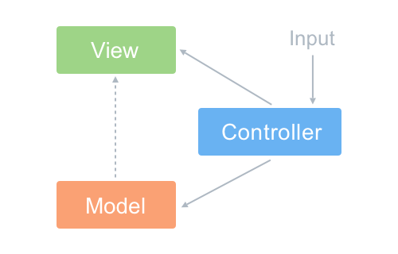
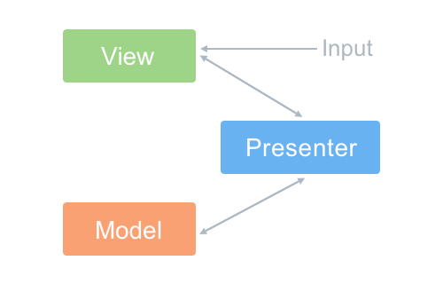
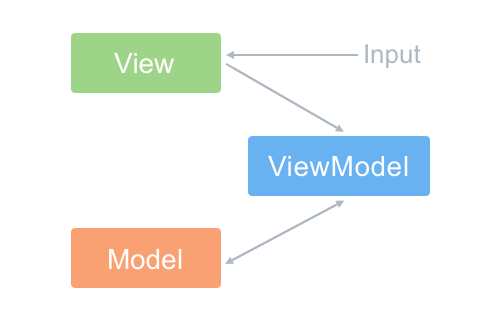

#### 设计理念 什么是MVVM？和MVM有什么区别？什么又是MVP？（https://zhuanlan.zhihu.com/p/27302766）

###### MVC

- M（model）用于封装业务逻辑相关得数据以及对数据得处理方法
- V（view）视图层，主要负责数据得展示
- C（controller）响应机制封装在此，当用户和应用产生交互，控制器中得触发器开始工作
  - M和V之间使用了观察者模式，V先在M上注册，进入观察M，以便更新在M上发生改变得数据（M只是写了注册和通知V的方法，实际操作在C中）
  - V和C之间使用了策略模式，V中引入了C得实例来实现特定得响应策略
    - 问题：每个事件都经过controller使得这层变得十分臃肿,而且V和C一般都是一一对应，这种紧密得连接让C得复用成了问题。

###### MVP


  - P（Presenter），通过P来实现V和C的解耦，mvc中C只知道M的接口，因此没办法控制V的更新，MVP中，V层的接口暴露给P，因此我们可以在P层中将V和C的变化绑定在一起，以此来实现V和M的更新

###### MVVM


- VM（ViewModel视图模型）：和mvp思路是相同的，只不过通过双向绑定将V和M的同步更新给自动化，当M变化VM就会自动更新，VM变化了V也会更新，这样就将Presenter中的工作给自动化了。


#### Vue


###### update视图
Vue由于双向绑定的实现，因此当数据发生变化时，会触发数据的set方法（Object.defineProperty）,set方法会让闭包的dep去通知（dep.notify）所有的watcher，Watcher通过get方法执行vm._update(vm._render(),从而进行视图更新（渲染wathcer视图更新，watch watcher，computed watcher）

###### vm._render (src/platforms/web/entry-runtime-with-compiler.js)
对模板进行编译  模板转换成ast语法树 将ast语法树转换成render
const {render} = compileToFunction(template,{});

###### Vue.prototype._update
```
Vue.prototype._update = function (vnode: VNode, hydrating?: boolean) {
  const vm: Component = this
  const prevEl = vm.$el
  const prevVnode = vm._vnode
  const restoreActiveInstance = setActiveInstance(vm)
  vm._vnode = vnode

  /*基于后端渲染Vue.prototype.__patch__被用来作为一个入口*/
  if (!prevVnode) {
    vm.$el = vm.__patch__(vm.$el, vnode, hydrating, false /* removeOnly */)
  } else {
    
    // __patch__既有初始化方法  又有更新（vm.$el重新赋值新的节点） 
    vm.$el = vm.__patch__(prevVnode, vnode)
  }
}

```

###### vm.__patch__ 即 patch 方法 （src/core/vdom/patch.js）
```
//创建patch方法 createPatchFunction的返回值，一个patch函数
export function createPatchFunction (backend) {
  //创建新元素 还是比对新老节点进行更新（patchVnode）
  return function patch (oldVnode, vnode, hydrating, removeOnly) {

    /*vnode不存在则直接调用销毁钩子*/
    if (isUndef(vnode)) {
      if (isDef(oldVnode)) invokeDestroyHook(oldVnode)
      return
    }

    let isInitialPatch = false
    const insertedVnodeQueue = []
    
    //没有老节点  可能是创建根元素 也可能是组件挂载
    if (isUndef(oldVnode)) {
      // empty mount (likely as component), create new root element
      isInitialPatch = true
      createElm(vnode, insertedVnodeQueue)
    } else {
      const isRealElement = isDef(oldVnode.nodeType)
      // 如果不是真实元素节点 并且是同一个节点
      if (!isRealElement && sameVnode(oldVnode, vnode)) {
        // patch existing root node  新老节点比对
        patchVnode(oldVnode, vnode, insertedVnodeQueue, null, null, removeOnly)
      } else {
        // 如果是真实元素节点
        if (isRealElement) {
          // mounting to a real element
          // check if this is server-rendered content and if we can perform
          // a successful hydration.
          /*当旧的VNode是服务端渲染的元素，hydrating记为true*/
          if (oldVnode.nodeType === 1 && oldVnode.hasAttribute(SSR_ATTR)) {
            oldVnode.removeAttribute(SSR_ATTR)
            hydrating = true
          }
          if (isTrue(hydrating)) {
            /*需要合并到真实Dom上*/
            if (hydrate(oldVnode, vnode, insertedVnodeQueue)) {
              invokeInsertHook(vnode, insertedVnodeQueue, true)
              return oldVnode
            } else if (process.env.NODE_ENV !== 'production') {
              warn(
                'The client-side rendered virtual DOM tree is not matching ' +
                'server-rendered content. This is likely caused by incorrect ' +
                'HTML markup, for example nesting block-level elements inside ' +
                '<p>, or missing <tbody>. Bailing hydration and performing ' +
                'full client-side render.'
              )
            }
          }
          // either not server-rendered, or hydration failed.
          // create an empty node and replace it
          /*如果不是服务端渲染或者合并到真实Dom失败，则创建一个空的VNode节点替换它*/
          oldVnode = emptyNodeAt(oldVnode)
        }

        // replacing existing element
        const oldElm = oldVnode.elm
        const parentElm = nodeOps.parentNode(oldElm)

        // create new node
        createElm(
          vnode,
          insertedVnodeQueue,
          // extremely rare edge case: do not insert if old element is in a
          // leaving transition. Only happens when combining transition +
          // keep-alive + HOCs. (#4590)
          oldElm._leaveCb ? null : parentElm,
          nodeOps.nextSibling(oldElm)
        )

        /*移除老节点*/
        if (isDef(parentElm)) {
          removeVnodes([oldVnode], 0, 0)
        } else if (isDef(oldVnode.tag)) {
          invokeDestroyHook(oldVnode) /*调用destroy钩子*/
        }
      }
    }

    invokeInsertHook(vnode, insertedVnodeQueue, isInitialPatch)
    return vnode.elm
  }
}
```

###### patchVnode
isStatic：静态节点标记优化，在比对节点时，会直接跳过静态节点的比较，从而减少比较过程
```
//节点比较
function patchVnode (oldVnode,vnode,insertedVnodeQueue,ownerArray,index,removeOnly) {
  /*两个VNode节点相同则直接返回*/
  if (oldVnode === vnode) {
    return
  }

  if (isDef(vnode.elm) && isDef(ownerArray)) {
    // clone reused vnode
    vnode = ownerArray[index] = cloneVNode(vnode)
  }

  const elm = vnode.elm = oldVnode.elm

  if (isTrue(oldVnode.isAsyncPlaceholder)) {
    if (isDef(vnode.asyncFactory.resolved)) {
      hydrate(oldVnode.elm, vnode, insertedVnodeQueue)
    } else {
      vnode.isAsyncPlaceholder = true
    }
    return
  }

  // reuse element for static trees.
  // note we only do this if the vnode is cloned -
  // if the new node is not cloned it means the render functions have been
  // reset by the hot-reload-api and we need to do a proper re-render.
  /*
    如果新旧VNode都是静态的，同时它们的key相同（代表同一节点），
    并且新的VNode是clone或者是标记了once（标记v-once属性，只渲染一次），
    那么只需要替换elm以及componentInstance即可。
  */
  if (isTrue(vnode.isStatic) &&
    isTrue(oldVnode.isStatic) &&
    vnode.key === oldVnode.key &&
    (isTrue(vnode.isCloned) || isTrue(vnode.isOnce))
  ) {
    vnode.componentInstance = oldVnode.componentInstance
    return
  }

  let i
  const data = vnode.data
  if (isDef(data) && isDef(i = data.hook) && isDef(i = i.prepatch)) {
    /*i = data.hook.prepatch，如果存在的话，见"./create-component componentVNodeHooks"。*/
    i(oldVnode, vnode)
  }

  // 比较儿子节点
  const oldCh = oldVnode.children
  const ch = vnode.children

  if (isDef(data) && isPatchable(vnode)) { /*调用update回调以及update钩子*/
    for (i = 0; i < cbs.update.length; ++i) cbs.update[i](oldVnode, vnode)
    if (isDef(i = data.hook) && isDef(i = i.update)) i(oldVnode, vnode)
  }

  /*如果这个VNode节点没有text文本时*/
  if (isUndef(vnode.text)) {
    /*新老节点均有children子节点，则对子节点进行diff操作，调用updateChildren （重点 updateChildren）*/
    if (isDef(oldCh) && isDef(ch)) {
      if (oldCh !== ch) updateChildren(elm, oldCh, ch, insertedVnodeQueue, removeOnly)
    } else if (isDef(ch)) {
      /*如果老节点没有子节点而新节点存在子节点，先清空elm的文本内容，然后为当前节点加入子节点*/
      if (process.env.NODE_ENV !== 'production') {
        checkDuplicateKeys(ch)
      }
      if (isDef(oldVnode.text)) nodeOps.setTextContent(elm, '')
      addVnodes(elm, null, ch, 0, ch.length - 1, insertedVnodeQueue)
    } else if (isDef(oldCh)) {
      /*当新节点没有子节点而老节点有子节点的时候，则移除所有ele的子节点*/
      removeVnodes(oldCh, 0, oldCh.length - 1)
    } else if (isDef(oldVnode.text)) {
      /*当新老节点都无子节点的时候，只是文本的替换，因为这个逻辑中新节点text不存在，所以直接去除ele的文本*/
      nodeOps.setTextContent(elm, '')
    }
  } else if (oldVnode.text !== vnode.text) {
    /*当新老节点text不一样时，直接替换这段文本*/
    nodeOps.setTextContent(elm, vnode.text)
  }
  /*调用postpatch钩子*/
  if (isDef(data)) {
    if (isDef(i = data.hook) && isDef(i = i.postpatch)) i(oldVnode, vnode)
  }
}
```

###### updateChildren diff算法 核心
```
diff算法核心就是4中命中优化 + 乱序比对字典复用
  1.头大于尾 (从左往右比对 oldStartIdx：0 newStartIdx:0)
    (a) old: a b c d      (b) old:a b c 
        new: a b c            new:a b c d

  2.尾小于头 (从右往左比对)
    (a) old: a b c d   (b)  old:  b c d
        new:   b c d        new:a b c d
    
  3.首位交叉 (老->新 新->老)
    (a) old： a b c d  (b) old：a b c d
        new： b c d a      new：d a b c

  4.乱序比对
    d c b a 
    a b c d
```

```
function updateChildren (parentElm, oldCh, newCh, insertedVnodeQueue, removeOnly) {
  let oldStartIdx = 0
  let newStartIdx = 0
  let oldEndIdx = oldCh.length - 1
  let oldStartVnode = oldCh[0]
  let oldEndVnode = oldCh[oldEndIdx]
  let newEndIdx = newCh.length - 1
  let newStartVnode = newCh[0]
  let newEndVnode = newCh[newEndIdx]
  let oldKeyToIdx, idxInOld, vnodeToMove, refElm

  // removeOnly is a special flag used only by <transition-group>
  // to ensure removed elements stay in correct relative positions
  // during leaving transitions
  const canMove = !removeOnly

  if (process.env.NODE_ENV !== 'production') {
    checkDuplicateKeys(newCh)
  }

  while (oldStartIdx <= oldEndIdx && newStartIdx <= newEndIdx) {
    if (isUndef(oldStartVnode)) {
      // 当乱序复用节点后 处理复用节点变为空的情况
      oldStartVnode = oldCh[++oldStartIdx] // Vnode has been moved left
    } else if (isUndef(oldEndVnode)) {
      // 当乱序复用节点后 处理复用节点变为空的情况
      oldEndVnode = oldCh[--oldEndIdx]
    } else if (sameVnode(oldStartVnode, newStartVnode)) {
      // 1.头大于尾（假装顺序比对成功）  双指针 只要一方头指针大于尾指针就结束
      // 如果两个节点相同  头指针后移（同时子节点存在接着递归比对）
      patchVnode(oldStartVnode, newStartVnode, insertedVnodeQueue, newCh, newStartIdx) //如果两个节点相同则递归比较子节点
      oldStartVnode = oldCh[++oldStartIdx]
      newStartVnode = newCh[++newStartIdx]

    } else if (sameVnode(oldEndVnode, newEndVnode)) {
      // 2.尾小于头（假装顺序比对成功）  双指针 只要一方尾指针小于头指针就结束
      // 如果两个节点相同  尾指针前移（同时子节点存在接着递归比对）
      patchVnode(oldEndVnode, newEndVnode, insertedVnodeQueue, newCh, newEndIdx) //如果两个节点相同则递归比较子节点
      oldEndVnode = oldCh[--oldEndIdx]
      newEndVnode = newCh[--newEndIdx]

    } else if (sameVnode(oldStartVnode, newEndVnode)) { // Vnode moved right
      // 交叉比对 老的第一个 和 新的最后一个 相同  将老的第一个 移到 老的最后一个
      patchVnode(oldStartVnode, newEndVnode, insertedVnodeQueue, newCh, newEndIdx)
      canMove && nodeOps.insertBefore(parentElm, oldStartVnode.elm, nodeOps.nextSibling(oldEndVnode.elm)) 
      oldStartVnode = oldCh[++oldStartIdx]
      newEndVnode = newCh[--newEndIdx]

    } else if (sameVnode(oldEndVnode, newStartVnode)) { // Vnode moved left
      // 交叉比对 老的最后一个 和 新的第一个 相同  将老的最后一个 移到 老的第一个
      patchVnode(oldEndVnode, newStartVnode, insertedVnodeQueue, newCh, newStartIdx)
      canMove && nodeOps.insertBefore(parentElm, oldEndVnode.elm, oldStartVnode.elm)
      oldEndVnode = oldCh[--oldEndIdx]
      newStartVnode = newCh[++newStartIdx]

    } else {
      //最后是乱序比对  先用旧节点字典库进行比对复用
      /*
        生成一个key与旧VNode的key对应的哈希表（只有第一次进来undefined的时候会生成，也为后面检测重复的key值做铺垫）
        比如childre是这样的 [{xx: xx, key: 'key0'}, {xx: xx, key: 'key1'}, {xx: xx, key: 'key2'}]  beginIdx = 0   endIdx = 2  
        结果生成{key0: 0, key1: 1, key2: 2}
      */
      if (isUndef(oldKeyToIdx)) oldKeyToIdx = createKeyToOldIdx(oldCh, oldStartIdx, oldEndIdx)
      
      /*如果newStartVnode新的VNode节点存在key并且这个key在oldVnode中能找到则返回这个节点的idxInOld（即第几个节点，下标）*/
      idxInOld = isDef(newStartVnode.key)? oldKeyToIdx[newStartVnode.key]: findIdxInOld(newStartVnode, oldCh, oldStartIdx, oldEndIdx)
      
      if (isUndef(idxInOld)) { // New element
        /*newStartVnode没有key或者是该key没有在老节点中找到则创建一个新的节点*/
        createElm(newStartVnode, insertedVnodeQueue, parentElm, oldStartVnode.elm, false, newCh, newStartIdx)

      } else {
        // 找到对应的节点进行复用
        vnodeToMove = oldCh[idxInOld]

        if (sameVnode(vnodeToMove, newStartVnode)) {

          //比较属性和子节点
          patchVnode(vnodeToMove, newStartVnode, insertedVnodeQueue, newCh, newStartIdx)

          // 将老节点赋值undefined 表示这个节点已经移走了
          oldCh[idxInOld] = undefined

          // 如果老节点中找到节点，将节点移到老节点的开始节点前
          canMove && nodeOps.insertBefore(parentElm, vnodeToMove.elm, oldStartVnode.elm)
        } else {
          // same key but different element. treat as new element
          createElm(newStartVnode, insertedVnodeQueue, parentElm, oldStartVnode.elm, false, newCh, newStartIdx)
        }
      }

      newStartVnode = newCh[++newStartIdx]
    }
  }

  //  1.头大于尾  old:a b c   new:a b c d 新的多余就插入
  //  2.尾大于头  old:b c d   new:a b c d 新的多余就插入
  if (oldStartIdx > oldEndIdx) {

    // 第一种情况（从左往右比对）结束  头指针大于尾指针 则新节点最后一个+1不存在，appendChild新节点
    // 第二种情况（从右往左比对）结束 头指针小于尾指针 当前比对节点的下一个存在，进行插入
    refElm = isUndef(newCh[newEndIdx + 1]) ? null : newCh[newEndIdx + 1].elm
    addVnodes(parentElm, refElm, newCh, newStartIdx, newEndIdx, insertedVnodeQueue)

  } else if (newStartIdx > newEndIdx) {
    // 第一种情况（从左往右比对）结束 和 第二种情况（从右往左比对）结束 老 头指针头小于尾指针
    removeVnodes(oldCh, oldStartIdx, oldEndIdx)
  }
}
```