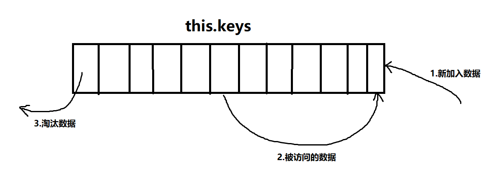

##### keep-alive（src/core/components/keep-alive.js）[官网](https://v2.cn.vuejs.org/v2/api/#keep-alive) [其他参考](https://nlrx-wjc.github.io/Learn-Vue-Source-Code/BuiltInComponents/keep-alive.html#_1-前言)
`<keep-alive> `是 Vue 实现的一个内置组件，也就是说 Vue 源码不仅实现了一套组件化的机制，也实现了一些内置组件，关于`<keep-alive>`组件，官网如下介绍： 
> `<keep-alive>`是Vue中内置的一个抽象组件，它自身不会渲染一个 DOM 元素，也不会出现在父组件链中。当它包裹动态组件时，会缓存不活动的组件实例，而不是销毁它们。

这句话的意思简单来说：就是我们可以把一些不常变动的组件或者需要缓存的组件用`<keep-alive>`包裹起来，这样`<keep-alive>`就会帮我们把组件保存在内存中，而不是直接的销毁，这样做可以保留组件的状态或避免多次重新渲染，以提高页面性能。


###### props
```
props: {
  include: patternTypes,  // 缓存白名单
  exclude: patternTypes, // 缓存黑名单
  max: [String, Number] // 缓存的组件实例数量上限
},
```

###### cacheVNode
this.cache:是一个对象，用来存储需要缓存的组件，this.keys是一个数组，用来存储每个需要缓存的组件的key，即对应cache对象中的键值。
```
created () {
  /* 缓存对象 */
  this.cache = Object.create(null)
  this.keys = []
},
```

###### include与exclude变化监听
```
mounted () {
  this.cacheVNode()

  /* 监视include以及exclude，在被修改的时候对cache进行修正 */
  this.$watch('include', val => {
    pruneCache(this, name => matches(val, name))
  })
  this.$watch('exclude', val => {
    pruneCache(this, name => !matches(val, name))
  })
},
methods: {
  cacheVNode() {
    const { cache, keys, vnodeToCache, keyToCache } = this
    if (vnodeToCache) {
      const { tag, componentInstance, componentOptions } = vnodeToCache
      cache[keyToCache] = {
        name: getComponentName(componentOptions),
        tag,
        componentInstance,
      }
      keys.push(keyToCache)
      // prune oldest entry
      if (this.max && keys.length > parseInt(this.max)) {
        pruneCacheEntry(cache, keys[0], keys, this._vnode)
      }
      this.vnodeToCache = null
    }
  }
},
```

###### pruneCache
对cache进行进行遍历，取出每一项的name值，用其与新的缓存规则进行匹配，如果匹配不上，则表示在新的缓存规则下改组件不需要被缓存
```
function pruneCache (keepAliveInstance: any, filter: Function) {
  const { cache, keys, _vnode } = keepAliveInstance
  for (const key in cache) {
    /* 取出cache中的vnode */
    const entry: ?CacheEntry = cache[key]
    /* name不符合filter条件的，同时不是目前渲染的vnode时，销毁vnode对应的组件实例（Vue实例），并从cache中移除 */
    if (entry) {
      const name: ?string = entry.name
      if (name && !filter(name)) {
        pruneCacheEntry(cache, key, keys, _vnode)
      }
    }
  }
}

/* 销毁vnode对应的组件实例（Vue实例） */
function pruneCacheEntry (cache: CacheEntryMap,key: string,keys: Array<string>,current?: VNode) {
  const entry: ?CacheEntry = cache[key]
  if (entry && (!current || entry.tag !== current.tag)) {
    entry.componentInstance.$destroy()
  }
  cache[key] = null
  remove(keys, key)
}
```

###### render 函数
```
render () {
  const slot = this.$slots.default
  /* 得到slot插槽中的第一个组件 */
  const vnode: VNode = getFirstComponentChild(slot)

  /* 获取该组件节点的componentOptions */
  const componentOptions: ?VNodeComponentOptions = vnode && vnode.componentOptions

  
  if (componentOptions) {
    // check pattern /* 获取组件名称，优先获取组件的name字段，否则是组件的tag */
    const name: ?string = getComponentName(componentOptions)
    const { include, exclude } = this

    /* name不在inlcude中或者在exlude中则直接返回vnode（没有取缓存） */
    if (
      // not included
      (include && (!name || !matches(include, name))) ||
      // excluded
      (exclude && name && matches(exclude, name))
    ) {
      return vnode
    }

    const { cache, keys } = this
    const key: ?string = vnode.key == null
      // same constructor may get registered as different local components
      // so cid alone is not enough (#3269)
      ? componentOptions.Ctor.cid + (componentOptions.tag ? `::${componentOptions.tag}` : '')
      : vnode.key
    
    /* 如果已经做过缓存了则直接从缓存中获取组件实例给vnode，还未缓存过则进行缓存 */
    if (cache[key]) {
      vnode.componentInstance = cache[key].componentInstance
      // make current key freshest
        /* 调整该组件key的顺序，将其从原来的地方删除并重新放在最后一个 */
      remove(keys, key)
      keys.push(key)
    } else {
      // delay setting the cache until update 延迟设置缓存直到更新
      this.vnodeToCache = vnode
      this.keyToCache = key
    }

    /* keepAlive标记位 */
    vnode.data.keepAlive = true
  }
  return vnode || (slot && slot[0])
}
```

###### 为什么要删除第一个缓存组件并且为什么命中缓存了还要调整组件key的顺序？
这其实应用了一个缓存淘汰策略LRU：
>LRU（Least recently used，最近最少使用）算法根据数据的历史访问记录来进行淘汰数据，其核心思想是“如果数据最近被访问过，那么将来被访问的几率也更高”

它的算法是这样子的：



1.将新数据从尾部插入到`this.keys`中；
2.每当缓存命中（即缓存数据被访问），则将数据移到`this.keys`的尾部；
3.当`this.keys`满的时候，将头部的数据丢弃；
>LRU的核心思想是如果数据最近被访问过，那么将来被访问的几率也更高，所以我们将命中缓存的组件key重新插入到`this.keys`的尾部，这样一来，`this.keys`中越往头部的数据即将来被访问几率越低，所以当缓存数量达到最大值时，我们就删除将来被访问几率最低的数据，即`this.keys`中第一个缓存的组件。这也就之前加粗强调的已缓存组件中最久没有被访问的实例会被销毁掉的原因所在。


